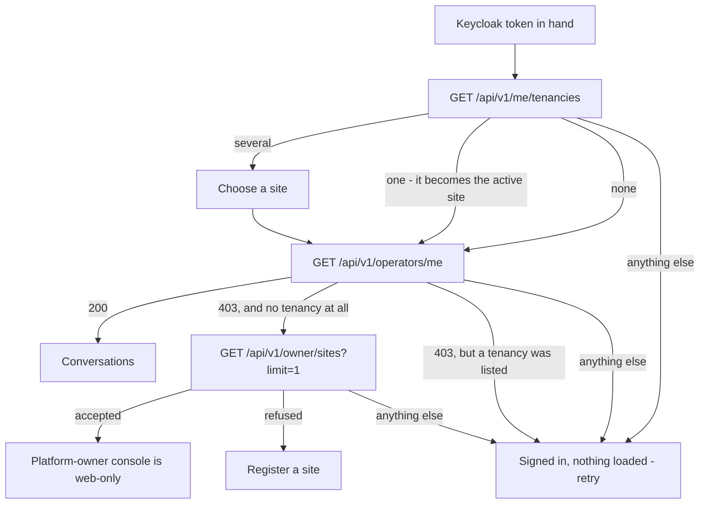
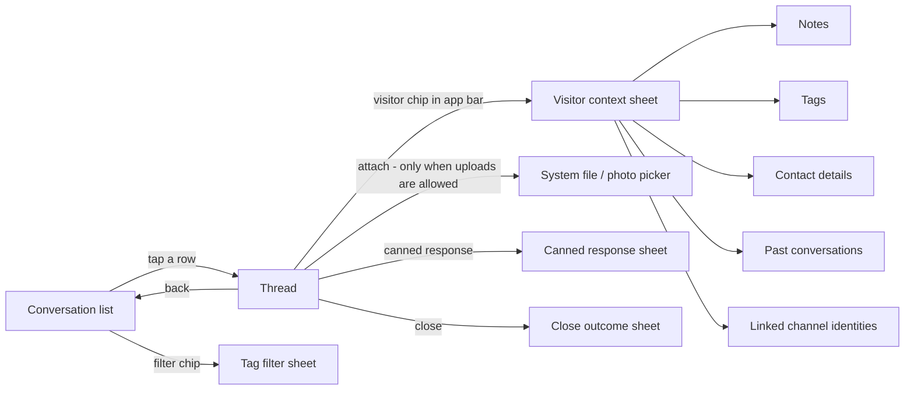
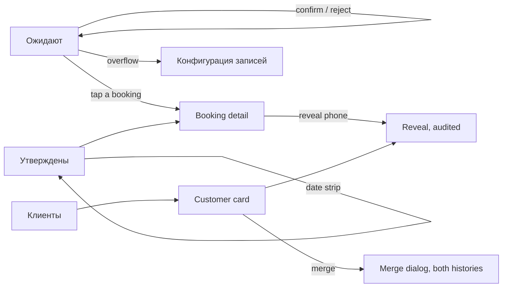
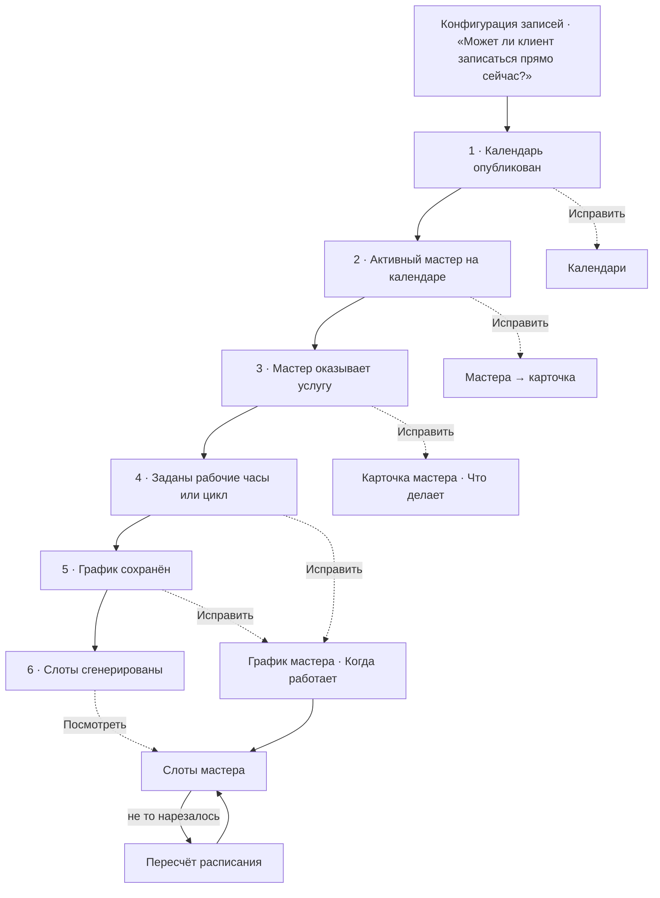
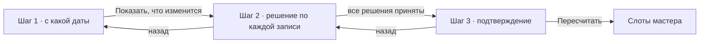
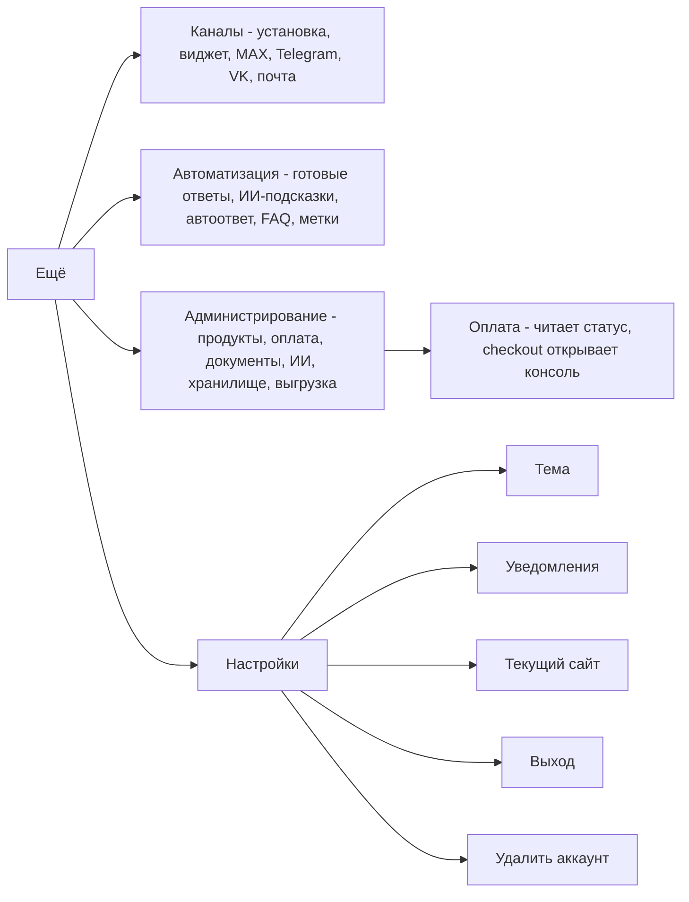

# Navigation and flows

Covers the ported scope in [`scope-inventory.md`](scope-inventory.md). Diagrams are Mermaid, the
same notation `ago-root`'s own architecture documents use, so they render wherever those do.

## The whole transition graph

Every screen the app has, and every navigation action that reaches one. This is the first thing to
review: if the shape is wrong here, nothing further down this document is worth reading.

Read it as five bands: what happens before a session exists, then the four bottom-bar destinations,
then **Ещё**. A dashed edge leaves the app (a Custom Tab, the system picker, the share sheet); a
dotted edge is an inbound deep link or a notification tap rather than something the operator
navigated to.

```mermaid
flowchart TD
  classDef out fill:#f6f5f1,stroke:#c8c3b6,color:#57546f;
  classDef entry fill:#ecebff,stroke:#4b3aff,color:#3324c9;
  classDef hub fill:#fff4e0,stroke:#7a4d00,color:#7a4d00;

  %% ─────────── до сессии ───────────
  Launch(["Запуск"]):::entry --> HasSession{"Есть сессия?"}
  HasSession -- "нет" --> SignIn["Вход"]
  HasSession -- "да" --> Router
  SignIn -- "Войти" --> KC["Keycloak"]:::out
  SignIn -- "Создать аккаунт" --> Onboard["Регистрация сайта"]
  SignIn -- "Соглашение" --> Policy["Документ политики"]
  KC --> Router{"Маршрутизация после входа"}
  Router -- "есть место оператора" --> ConvList
  Router -- "несколько тенантов" --> SitePick["Выбор сайта"]
  SitePick --> ConvList
  Router -- "только владелец платформы" --> OwnerStop["Владелец платформы: только веб"]
  Router -- "ни то ни другое" --> Onboard
  OwnerStop -. "Открыть в браузере" .-> KCWeb["Веб-консоль"]:::out
  Onboard --> ConvList

  InviteLink(["App Link приглашения"]):::entry -. "открыт по ссылке" .-> Invite["Приглашение"]
  Invite -- "Принять" --> Redeem["Ввод кода приглашения"]
  Redeem --> Router
  PolicyLink(["Ссылка на политику"]):::entry -. "без сессии" .-> Policy

  PushMsg(["Push: новое сообщение"]):::entry -. "тап" .-> Thread
  PushBook(["Push: запись ждёт решения"]):::entry -. "тап" .-> BookingCard
  ConvLink(["App Link диалога"]):::entry -. "тап" .-> Thread

  %% ─────────── 1. Диалоги ───────────
  subgraph D["1 · Диалоги"]
    direction TB
    ConvList["Список диалогов · Мои / Ожидают"]
    Thread["Тред"]
    Sheet["Шторка посетителя"]
    Notes["Заметки команды"]
    Contacts["Контактные данные"]
    History["Прошлые диалоги"]
    Ident["Связанные каналы"]
    TagSheet["Шторка меток"]
    Canned["Готовые ответы"]
    CloseSheet["Итог закрытия"]
    Search["Поиск по диалогам"]
    Restricted["Ограниченные посетители"]
  end

  ConvList -- "тап по строке" --> Thread
  ConvList -- "чип фильтра" --> TagSheet
  ConvList -- "лупа" --> Search
  ConvList -- "⋮ · site:configure" --> Restricted
  Search -- "тап по находке" --> Thread
  Thread -- "назад" --> ConvList
  Thread -- "чип посетителя" --> Sheet
  Thread -. "скрепка · если разрешены вложения" .-> Picker["Системный выбор файла"]:::out
  Thread -- "/ в начале строки" --> Canned
  Thread -- "⋮ → Закрыть" --> CloseSheet
  CloseSheet -- "итог выбран" --> ConvList
  Sheet -- "Заметки" --> Notes
  Sheet -- "Контакты" --> Contacts
  Sheet -- "Прошлые" --> History
  Sheet -- "Каналы" --> Ident
  Sheet -- "+ метка" --> TagSheet
  History -- "тап" --> Thread
  Contacts -- "Показать · под аудитом" --> Contacts

  %% ─────────── 2. Записи ───────────
  subgraph Z["2 · Записи"]
    direction TB
    Pending["Ожидают"]
    Confirmed["Утверждены"]
    Clients["Клиенты"]
    BookingCard["Карточка записи"]
    ClientCard["Карточка клиента"]
    Merge["Объединение клиентов"]
    Cfg["Конфигурация записей"]:::hub
    Cal["Календари"]
    Services["Услуги"]
    Workers["Мастера"]
    WorkerCard["Карточка мастера"]
    Schedule["График мастера"]
    Slots["Слоты мастера"]
    Recut1["Пересчёт · шаг 1: дата"]
    Recut2["Пересчёт · шаг 2: решения"]
    Recut3["Пересчёт · шаг 3: подтверждение"]
    Exceptions["Исключения: выходной и короткий день"]
    Origins["Разрешённые источники"]
    MergeLog["Журнал объединений"]
  end

  Pending -- "сегмент" --> Confirmed
  Confirmed -- "сегмент" --> Clients
  Clients -- "сегмент" --> Pending
  Pending -- "тап" --> BookingCard
  Pending -- "Подтвердить / Отклонить" --> Pending
  Confirmed -- "лента дат" --> Confirmed
  Confirmed -- "тап" --> BookingCard
  Clients -- "тап" --> ClientCard
  ClientCard -- "Объединить" --> Merge
  Merge -- "необратимо, после подтверждения" --> Clients
  BookingCard -- "Показать телефон · под аудитом" --> BookingCard

  Pending -- "⋮ Конфигурация" --> Cfg
  Cfg -- "«Не хватает» → Исправить" --> Cal
  Cfg -- "«Не хватает» → Исправить" --> Workers
  Cfg -- "«Не хватает» → Исправить" --> Services
  Cfg -- "«Не хватает» → Исправить" --> Schedule
  Cfg -- "«Не хватает» → Посмотреть слоты" --> Slots
  Cfg --> Exceptions
  Cfg --> Origins
  Cfg --> MergeLog
  Workers -- "тап" --> WorkerCard
  Workers -- "＋" --> WorkerCard
  WorkerCard -- "Когда работает" --> Schedule
  WorkerCard -- "Что получилось" --> Slots
  WorkerCard -- "Что делает" --> Services
  Schedule -- "сохранить" --> WorkerCard
  Schedule -- "Пересчитать уже нарезанное" --> Recut1
  Slots -- "Пересчитать" --> Recut1
  Recut1 -- "Показать, что изменится" --> Recut2
  Recut2 -- "все решения приняты" --> Recut3
  Recut3 -- "выполнено" --> Slots

  %% ─────────── 3. Команда ───────────
  subgraph T["3 · Команда"]
    direction TB
    TeamChat["Общение"]
    People["Люди"]
    InviteSheet["Приглашение оператора"]
  end

  TeamChat -- "сегмент · site:manage_operators" --> People
  People -- "＋ Пригласить" --> InviteSheet
  InviteSheet -. "Поделиться" .-> Share["Системная шторка «Поделиться»"]:::out

  %% ─────────── 4. Аналитика ───────────
  subgraph A["4 · Аналитика"]
    direction TB
    MyNumbers["Мои показатели"]
    SiteStats["По сайту"]
    Conversion["Конверсия"]
    TagStats["По меткам"]
    Funnel["Воронка записи"]
    Reveals["Показы телефонов"]
  end

  MyNumbers -- "⋮ · site:configure" --> SiteStats
  MyNumbers -- "⋮ · site:configure" --> Conversion
  MyNumbers -- "⋮ · site:configure" --> TagStats
  MyNumbers -- "⋮ · site:configure" --> Funnel
  MyNumbers -- "⋮ · calendar:configure" --> Reveals

  %% ─────────── 5. Ещё ───────────
  subgraph M["5 · Ещё"]
    direction TB
    More["Ещё"]
    Install["Установка виджета"]
    WidgetCfg["Виджет на сайте"]
    ChMax["MAX"]
    ChTg["Telegram"]
    ChVk["VK"]
    ChMail["Почта"]
    CannedCfg["Готовые ответы"]
    AiSug["ИИ-подсказки"]
    AutoReply["Автоответ вне смены"]
    Faq["База знаний"]
    TagsCfg["Метки"]
    Products["Продукты"]
    Billing["Оплата"]
    Docs["Документы"]
    AiCfg["ИИ и данные"]
    Storage["Хранилище"]
    Export["Выгрузка"]
    Settings["Настройки"]
    Theme["Тема"]
    Notif["Уведомления"]
    SiteSwitch["Текущий сайт"]
    DeleteAcc["Удалить аккаунт"]
  end

  More --> Install
  More --> WidgetCfg
  More --> ChMax
  More --> ChTg
  More --> ChVk
  More --> ChMail
  More --> CannedCfg
  More --> AiSug
  More --> AutoReply
  More --> Faq
  More --> TagsCfg
  More --> Products
  More --> Billing
  More --> Docs
  More --> AiCfg
  More --> Storage
  More --> Export
  More --> Settings
  Settings --> Theme
  Settings --> Notif
  Settings --> SiteSwitch
  Settings --> DeleteAcc
  Settings -- "Выход" --> SignIn
  SiteSwitch -- "другой сайт" --> ConvList
  Billing -. "Оформить оплату" .-> Checkout["Оплата в веб-консоли"]:::out
  Export -. "Скачать архив" .-> Dl["Системный загрузчик"]:::out
  Storage -- "долгое нажатие" --> Storage

  %% ─────────── нижняя навигация ───────────
  ConvList <-- "нижняя навигация" --> Pending
  Pending <-- "нижняя навигация" --> TeamChat
  TeamChat <-- "нижняя навигация" --> MyNumbers
  MyNumbers <-- "нижняя навигация" --> More
```

Two things the picture asserts that are easy to miss:

- **The booking-configuration hub is the only new junction this iteration adds**, and it is the one
  screen in the app whose whole job is to state an order. Everything under it was already reachable
  in the console; what was not reachable was the sentence "these six things, in this order".
- **Nothing in Записи leaves the app any more.** The worker re-cut used to be the single arrow in
  this document that opened the console; it is now three in-app steps
  ([`scope-inventory.md`](scope-inventory.md) §4).

## The top-level shape

The console has a seven-section left rail (`consoleNav.ts`). Seven does not fit a bottom navigation
bar — Material 3 allows three to five destinations — so the seven sections map onto **five**, with
the three configuration sections folded behind one.

| # | Bottom-bar destination | Console sections it carries | Drawn when |
|---|---|---|---|
| 1 | **Диалоги** | Диалоги | always |
| 2 | **Записи** | Записи (calendar) | `calendar:configure`, or any booking action permission, or `customer:read` |
| 3 | **Команда** | Команда | always (Общение is ungated) |
| 4 | **Аналитика** | Аналитика | always (Мои показатели is ungated) |
| 5 | **Ещё** | Каналы, Автоматизация, Администрирование, Settings | always |

**The order is by how often a shift touches it, not by the console's own rail order.** Команда sits
third and Аналитика fourth: team chat is something an operator reaches for during a shift, and
analytics is something they read after one. An earlier draft of this document had those two the
other way round; the author corrected it, and the corrected order is what every mockup frame, the
tablet rail and `architecture.md` now state.

**A destination with nothing inside it is not drawn** — the identical rule `buildSection` applies in
the console, where a section with zero visible items returns `null` and disappears. An ordinary
operator with no calendar grant therefore sees four destinations, not five greyed ones; an
administrator sees five. The floor is four, because Команда, Аналитика and Ещё each always carry at
least one item, so the bar never degrades into something Material has no shape for.

The **Ещё** destination is a list-of-lists screen — the three folded sections as headers, their
items as rows — rather than a second bottom bar or a nested tab strip. It is also where Settings,
the active-site switcher and sign-out live.

## Sign-in, and the three-way routing that must not be simplified

This is the flow most likely to be got wrong, because the wrong version looks correct.
`GET /api/v1/operators/me` answers `403` for a platform owner and for a brand-new registrant
alike — the absence of an operator seat, not a statement about which kind of caller this is. Reading
that `403` as "therefore a registrant" is exactly the defect `12-04` fixed and `adr/0063` was
written about, and it would silently offer a platform owner a form that permanently makes them an
ordinary tenant.

Note the `Fail` arms: a `401`, a `5xx` or a network failure is **not** folded into either answer.
That is the console's own `11-17` correction, and it ports unchanged — extended here to the *owner*
probe as well, which `CallbackPage` sends to `/onboarding` on a non-answer. The console's reason for
that was that the server independently refused the submission; `12-05` withdrew that refusal
(`adr/0063`'s amendment), so what is left is the inference `adr/0063` itself names as the defect
class. The retry arm already exists and costs nothing to reuse.

**The tenancy question is asked first, and that is a correction `26-12` made to this diagram rather
than a restatement of it.** The earlier version asked it *after* a `200` from `operators/me`, which
cannot work: `ResolveOperatorIdentityHandler` (`ago-chat`, `13-07`/`adr/0068`) resolves an identity
with **more than one eligible tenancy and no `X-Ago-Active-Site` header to nothing at all** — picking
one would be the cross-tenant misdirection that ADR exists to forbid — so `RequireOperatorIdentity`
refuses and `GET /api/v1/operators/me` answers `403` for a two-shop operator on a fresh device. Down
the old order, that `403` reaches the owner probe, is refused, and lands a working operator on the
*site-registration* arm: `12-04`'s exact defect, produced by a different identity. `/me/tenancies` is
gated by the weaker `RequireKeycloakIdentity` precisely so it can answer for an identity with zero
tenancies *or* several, which is why asking it first is the order the server's own contract implies.
`ago-console`'s `PermissionsProvider` already sequences its two calls this way and says why ("set
before the next fetch is built"); it does **not** apply that ordering to `CallbackPage`'s routing,
which looks like the same latent bug on the web, on a first sign-in before any active site is stored.

One more arm the old diagram had no place for: a `403` from `operators/me` while `/me/tenancies` has
just listed a tenancy this identity may sign into. The two reads contradict each other, so the app
renders a retry rather than believing the refusal — offering the registration form there would invite
an operator with a live seat to register a second shop, which is `12-04`'s defect class reached from
the other direction.

**The sign-in screen names no deployment.** An earlier draft printed the console's own hostname
under the two buttons so a tester could tell which environment a build talked to. It is gone: an
operator holding the app has no reason to think about the web console at all, and the debugging need
it served is served better by the build variant's own name in Settings → О приложении, where a
tester looks and an operator does not.

## Диалоги — the flow the app exists for

Five decisions in that picture are worth stating rather than leaving to be inferred:

- **The list has a segmented control, not two screens.** "Мои" and "Ожидают" are the console's own
  two groups inside one rail; splitting them into sibling destinations would make claiming a waiting
  conversation a navigation act rather than a decision.
- **Диалоги carries four console routes, not one.** `/` is the list, `/conversations/:id` is the
  thread, `/conversations/search` is the app bar's own search field rather than a destination, and
  `/conversations/restricted` sits in the app bar's overflow menu, gated on `site:configure`. An
  operator who does not hold that permission has a shorter overflow, not a disabled one — the same
  hide-when-lacking rule the console's rail applies.
- **`/conversations/all` is a third segment of the list, not an overflow item** (`26-90`). This used
  to be drawn beside `/conversations/restricted` in the overflow, and the approved mockup's own
  transition graph moved it: on a phone, a separate destination would mean an administrator *leaves*
  their own list to look at everybody's, where the control that already separates «Мои» from
  «Ожидают» separates this too. It is gated on `site:configure` — the permission
  `GetAllConversationsForSiteHandler` actually enforces, **not** `conversation:read`, which every
  operator holds — and an operator without it has a two-segment control, never a greyed-out third
  (`visibleConversationListTabs`).
- **A row on that third segment does not open a thread, and this is a server fact.** The hub's own
  `JoinConversationAsync` *assigns* before it reads, and `Conversation.AssignTo` accepts only a
  `Waiting` conversation — so a tap would claim a queued conversation, or throw for one that is
  assigned elsewhere or closed. `ago-console`'s own `AdminConversationsPage` is read-only for exactly
  this reason. The tab says so in one line rather than offering a tap that cannot work; making an
  administrator able to *read* any conversation's history is a server change nobody has funded yet.
- **The visitor context is a bottom sheet, not a route.** Everything in it — notes, tags, contact
  details, visitor history, channel identities, the block and upload-grant controls — is read *while*
  composing. A route would unmount the composer and lose the draft, which is exactly the loss the
  console restructured itself to prevent (`11-06`).
- **The attach control is conditional, not permanent.** See the next section — it is the one control
  in the thread whose presence is data, not layout.
- **A new assignment arriving never navigates.** The console's rule is "announced in place, never
  acted on for the operator": a badge, a count, a live region, and nothing that moves the operator
  mid-sentence. On Android the equivalents are a badge on the Диалоги destination, a notification
  when the app is backgrounded (once push exists), and no automatic navigation, ever.

### The attach control, and what actually gates it

The console draws its own **Прикрепить** button unconditionally (`workspace/Composer.tsx` — the
button and its hidden `<input type="file">` are rendered for every operator on every conversation).
Ported literally, so would the app's paperclip.

There are two real switches in this product that decide whether a file can move in this
conversation, and neither one is currently allowed to touch that button:

| Switch | Where it lives | What it actually decides |
|---|---|---|
| `WidgetConfig.AllowAttachmentUploadsByDefault` | site-wide, `/channels/widget` (`25-104`) | whether a **new** conversation starts with its own upload grant already on |
| `Conversation.hasAttachmentUploadGrant` | per conversation, the visitor sheet's own toggle (`23-78`) | whether **this** conversation accepts an upload right now |
| `conversation:attachment_upload_grant` | operator permission | whether this operator may flip the toggle above — the toggle is hidden without it |

The app draws the paperclip **exactly when `hasAttachmentUploadGrant` is true for the open
conversation**, and omits it — not disables it — otherwise, the same hide-rather-than-disable posture
`AttachmentUploadGrantToggle` and `CloseConversationButton` already state for themselves: a disabled
control advertises a capability to somebody who will never use it.

Two consequences worth naming, because both are deliberate:

- A site that has never turned `allowAttachmentUploadsByDefault` on sees no paperclip until an
  operator grants upload on that conversation from the visitor sheet. That is the product's own
  configured answer being visible, which it currently is not.
- The grant is nominally about the **visitor's** uploads, and the composer's button is the
  **operator's**. Tying them together is a product judgement this document is making, not a rule the
  backend enforces: an operator sending a file into a conversation the tenant has configured as
  attachment-free is the same tenant decision read from the other end. If the author wants the two
  separated — operators may always attach, visitors only when granted — that is a one-line change
  here and a sentence in `scope-inventory.md`, and it should be decided before `26-01`'s first
  thread slice rather than after.

## Записи — the calendar flow

Записи carries eleven console routes, which is too many for one screen and too few to earn a second
bottom bar. It splits the way the console's own nav already groups them (`buildCalendarItems`'s
"operational screens first, then the setup dictionaries"): three operational screens in a segmented
control at the top of the destination, and **everything configurational behind one hub**, which is
the change this iteration makes.

| In the segmented control | Behind «Конфигурация записей» |
|---|---|
| Ожидают, Утверждены, Клиенты | Календари, Услуги, Мастера, График мастера, Слоты, Пересчёт, Исключения, Разрешённые источники, Журнал объединений |

The two operational tabs are **Ожидают** and **Утверждены** — verb forms, not the console's own
"В ожидании"/"Утверждённые". A tab label answers "what is in here", and the shortest honest answer is
what these rows are doing.

### Конфигурация записей — the flow this iteration designs

The author's own description of setting this up in the console: *"самый мутный флоу, который я просто
заполнил «как-то», тыкаясь как слепой котёнок"*. That is worth taking literally, because the cause is
structural and it is checkable.

**What is actually wrong with the console's version.** Six facts must be true before a stranger can
book, and the server already computes all six in one read — `GET /booking-readiness`, rendered by
`calendar/BookingReadiness.tsx`:

1. Календарь опубликован
2. На календаре есть активный мастер
3. Этот мастер оказывает услугу
4. У этого мастера заданы рабочие часы или циклический график
5. У этого мастера сохранён график
6. Слоты сгенерированы в пределах горизонта

That list is a **dependency chain**: each step is meaningless until the one above it holds. The
console scatters the six across five routes (`/calendar/setup`, `/calendar/masters`,
`/calendar/services`, `/calendar/schedule`, plus the worker card's own schedule section), and
renders the one component that states the order as a *passive panel on two of them*. So the tenant
meets the chain in whatever order the navigation happens to present it, which is not the order it has
to be done in.

Three more structural problems, each verified in the console's own source rather than inferred:

- **"Расписание" names two different things.** The nav item Расписание is `/calendar/schedule` —
  exceptions, i.e. "this worker is off on the 14th" and "on the 15th they finish early". The
  **Расписание** button on a worker's own card is `WorkerScheduleSection` — the generating template:
  weekly or cycle, slot length, buffer, horizon, materialise-from. Same word, two unrelated surfaces,
  and the second one — the one that actually produces slots — has no route of its own to be found at.
- **"When does this worker work" is answered on two screens.** Working-hours rules are a form on
  `/calendar/setup`; the schedule template is a section on the worker's card at `/calendar/masters`.
  Both are required (preconditions 4 and 5) and neither mentions the other.
- **Cause and effect are three screens apart.** The template is edited on the worker card, its
  output is visible only at `/calendar/masters/:id/slots`, and fixing days already cut under an older
  template is a fourth screen, `/recut`. Nothing on the editing screen shows what the edit produced.

**What the app does instead.** One hub, and the readiness chain is its spine rather than a panel on
it:

Five decisions make that more than a re-skin:

1. **The readiness read is the screen, not a panel on it.** `GET /booking-readiness` already answers
   the exact question a tenant is trying to answer, per calendar, with a fix-it target per unmet
   precondition. The hub renders precisely that, in order, with everything met collapsed and the
   first unmet row expanded. Nothing is re-derived client-side — that is `23-23`'s own rule and it is
   what keeps this screen from becoming a second, disagreeing copy of the booking path's conjunction.
2. **The worker's card owns the whole "when does this person work" question.** Four sections, in the
   order somebody answers them: Кто (name), Где (calendar — a worker has exactly one), Что делает
   (services performed), Когда работает (the template *and* the working-hours rules, on one screen),
   Что получилось (a live slot count with a link to the day-grouped list). The console's split
   between `/calendar/setup`'s working-hours form and the card's own schedule section is not
   reproduced; it is the split that makes precondition 4 and 5 feel like the same unanswered question
   asked twice.
3. **"Расписание" is not used as a label at all.** The template screen is **График мастера**, the
   exception screen is **Исключения: выходной и короткий день**. Neither name is ambiguous, and the
   ambiguity they replace was a real one.
4. **Editing the template shows its own output before it is saved.** The console already computes
   the arithmetic sentence ("услуга 70 мин займёт 3 слота" — `slotsNeededFor`, mirroring
   `ConsecutiveRunFinder.ComputeSlotsNeeded`); the app keeps that and adds the two numbers a tenant
   actually wants — how many days the horizon covers and how many slots a typical day yields — read
   back after the save, on the same screen, with a direct link to the slots it made. Cause and effect
   stop being three screens apart.
5. **The re-cut is reachable from the two screens where the need is discovered** — the template
   screen (after changing a template that has already cut days) and the slots list (after seeing the
   wrong days) — rather than from a row in a list of workers.

The dictionaries (Календари, Услуги, Мастера) are also reachable flatly, below the chain, for the
tenant who knows what they came to change. The chain is the answer to "why can nobody book", not a
wizard somebody has to walk through to rename a service.

**Two gaps this design meets and does not paper over**, both real and both named rather than
designed around — **the first is closed as of `26-96`**:

- ~~`calendarApi.ts` exports `createService` and no `updateService`/`deleteService`.~~ **Closed by
  `26-96`.** `PUT /services/{id}` exists now, carrying the five editable fields and `isActive`, and
  both clients have an edit plus a «Снять с продажи» affordance. There is still **no
  `deleteService`**, and that is the answer rather than the remainder of the gap: four server-side
  read models resolve a *past booking's* service name through the `services` row, so a delete would
  retroactively blank the service on every booking that ever used it
  (`Ago.Calendar.Domain.Service.IsActive`). `deleteCalendar` is still genuinely absent and unclaimed.
  The app's own Услуги screen landed with `26-96` as a segment of Записи, not under this hub —
  the hub this section designs does not exist yet, and the item needed a way in rather than a reason
  to build one ahead of its own scope.
- `PendingBooking` carries `workerId`, `serviceId` and `calendarId` and **no names for any of
  them** (`ConfirmedBooking`, by contrast, carries `workerDisplayName`, `serviceName` and
  `customerDisplayName`). The screen where a human has seconds to decide is the one with no words on
  it; the read-only screen has them all. The app's pending cards are drawn with names because that is
  what the screen must say, and that requires the queue response to grow three fields — also its own
  item.

### The worker re-cut is in scope

An earlier draft excluded `/calendar/masters/:workerId/recut` as too destructive for a small screen,
linking to the console instead. The author's answer: *"это типовая операция для тенанта, который рулит
расписанием, его нельзя исключать"* — and that is right. A tenant who changes a shift pattern needs
the already-cut days fixed on the same day, and an app that hands that back to a desktop browser is
an app that does not run a schedule.

It ports as three real steps, with the middle one designed for a phone rather than shrunk onto one:

- **Step 2 is a card per booking, not a row.** Each card carries the date, time, service, customer
  and masked phone, and two buttons — Отменить and Оставить. There is no "apply to all", deliberately:
  the whole point of this step is that each booking is somebody's appointment.
- **The step cannot be left half-done.** A running counter ("решено 4 из 7") is pinned, and the
  continue action stays disabled while any booking is undecided. The console relies on the operator
  scrolling a table to notice; a phone cannot, so the count is stated rather than implied.
- **Step 3 restates what will be destroyed**, counts the cancellations separately from the keeps, and
  the confirm is the only destructive-tone button in the flow. No `Dialog`, matching the console's own
  inline-confirmation shape.

The risk that motivated the earlier exclusion is real, and it is answered by those three properties
rather than by removing the capability.

## Команда, Аналитика

Команда is two screens behind one segmented control: **Общение** (ungated, every operator) and
**Люди** (`site:manage_operators`, and absent rather than disabled without it). The invite action
ends in the Android share sheet on the invite URL, which is strictly better than the console's copy
button because sending the link is the actual goal.

Аналитика opens on **Мои показатели** — ungated, and the one analytics screen that belongs on a phone
at all — with the five `site:configure`/`calendar:configure` screens in the overflow. The ordering is
deliberate: the screen an operator opens about themselves is the destination; the site-wide reports
are a menu away.

## Ещё — configuration

One screen listing three grouped sections, each row a destination. No nesting beyond that: every
screen under Ещё is one tap from the list, and none of them opens another list.

`Удалить аккаунт` appears twice in the console's own terms — once as an Администрирование row and
once at the foot of Settings. In the app it appears **only** at the foot of Settings, which is the
relocation the inventory records.

## Deep links

| Link | Opens |
|---|---|
| `…/invite/{code}` | The invite preview, then redemption; falls back to the console when the app is not installed |
| `…/conversations/{id}` | That thread, once a session exists |
| `…/policies/{key}` | The policy reader, with no session required |
| A push notification for a new message | That thread, never the list |
| A push notification for a pending booking | That booking, never the queue |

The two notification rows describe behaviour that arrives with push — the app's first dependency,
not a footnote to it ([`plan.md`](plan.md) §1).

## What the back button does

Android's system back is a real contract and the console has no equivalent of it, so it is stated
once here:

- Back from a thread returns to the list, keeping the list's scroll position and filters.
- Back from any Ещё screen returns to the Ещё list, not to the previous bottom-bar destination.
- Back on a bottom-bar destination other than Диалоги returns to Диалоги; back on Диалоги exits.
- Back inside the re-cut returns to the previous step, and leaving the flow entirely discards the
  decisions with an explicit confirmation — they are not persisted server-side until step 3 commits.
- The visitor sheet, every filter sheet and every confirmation dialog are dismissed by back before
  the screen under them is.
- Back never discards a composer draft silently — a non-empty draft survives leaving the thread, the
  same guarantee the console gives by never unmounting the composer.
