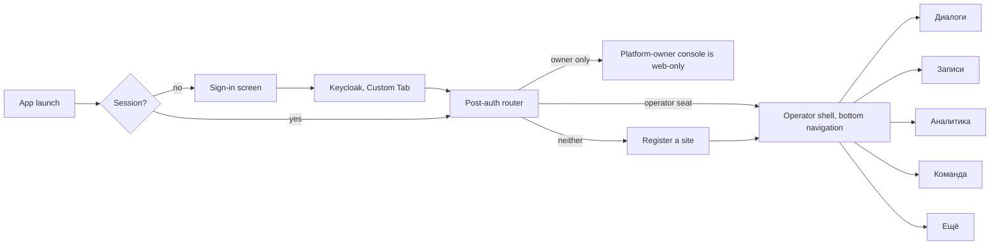
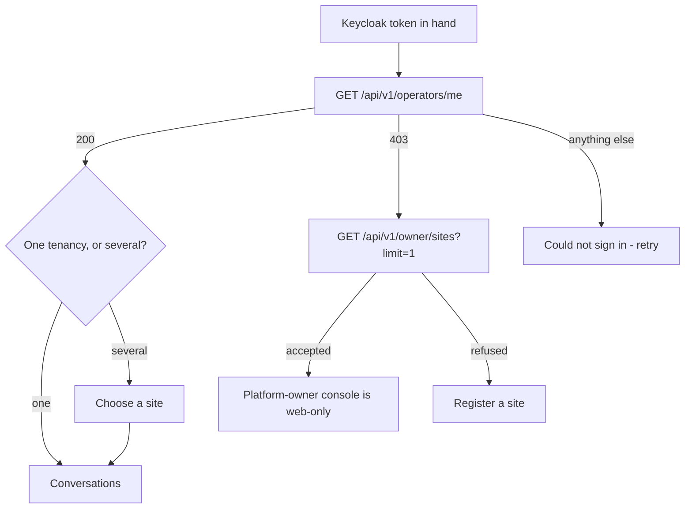
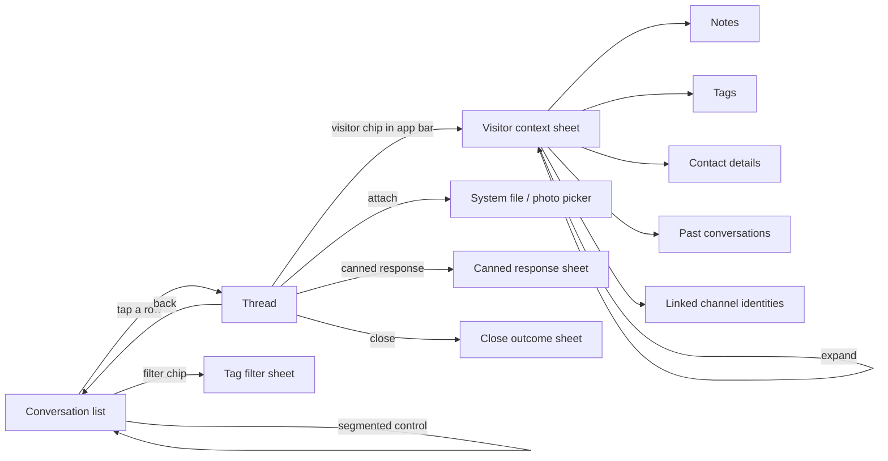
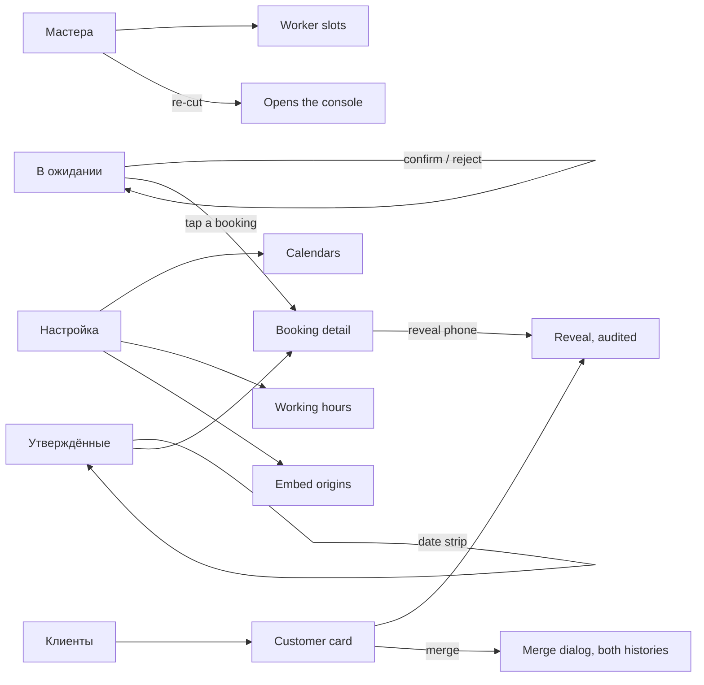
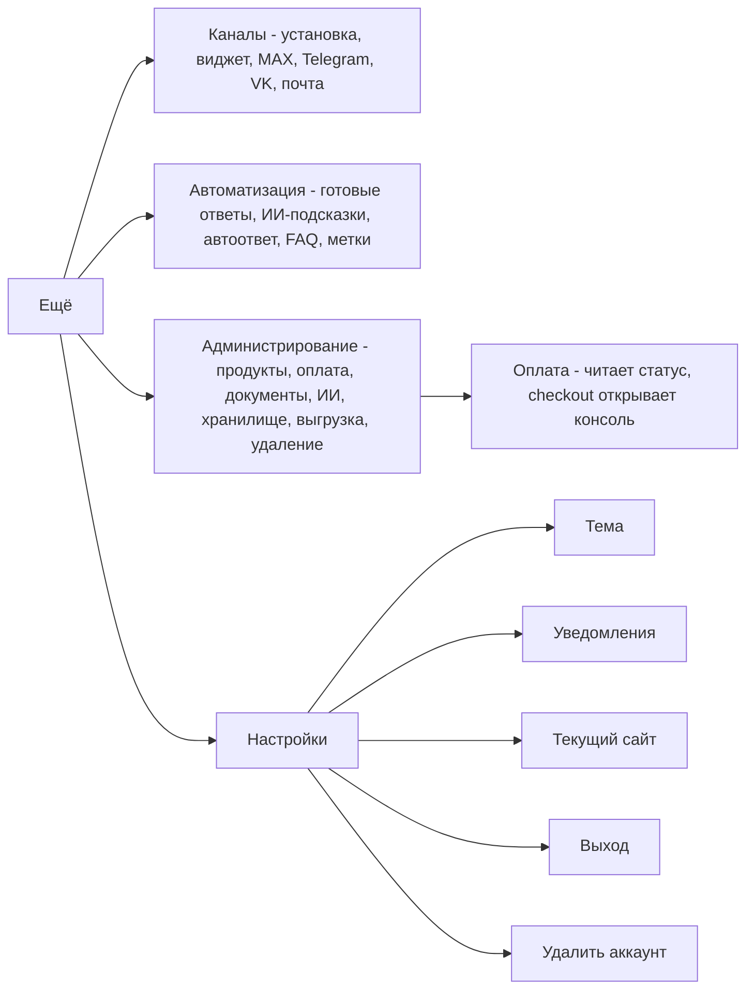

# Navigation and flows

Covers the ported scope in [`scope-inventory.md`](scope-inventory.md). Diagrams are Mermaid, the
same notation `ago-root`'s own architecture documents use, so they render wherever those do.

## The top-level shape

The console has a seven-section left rail (`consoleNav.ts`). Seven does not fit a bottom navigation
bar — Material 3 allows three to five destinations — so the seven sections map onto **five**, with
the three configuration sections folded behind one.

| Bottom-bar destination | Console sections it carries | Drawn when |
|---|---|---|
| **Диалоги** | Диалоги | always |
| **Записи** | Записи (calendar) | `calendar:configure`, or any booking action permission, or `customer:read` |
| **Аналитика** | Аналитика | always (Мои показатели is ungated) |
| **Команда** | Команда | always (Общение is ungated) |
| **Ещё** | Каналы, Автоматизация, Администрирование, Settings | always |

**A destination with nothing inside it is not drawn** — the identical rule `buildSection` applies in
the console, where a section with zero visible items returns `null` and disappears. An ordinary
operator with no calendar grant therefore sees four destinations, not five greyed ones; an
administrator sees five. The floor is four, because Аналитика, Команда and Ещё each always carry at
least one item, so the bar never degrades into something Material has no shape for.

The **Ещё** destination is a list-of-lists screen — the three folded sections as headers, their
items as rows — rather than a second bottom bar or a nested tab strip. It is also where Settings,
the active-site switcher and sign-out live.

## Sign-in, and the three-way routing that must not be simplified

This is the flow most likely to be got wrong, because the wrong version looks correct.
`GET /api/v1/operators/me` answers `403` for a platform owner and for a brand-new registrant
alike — the absence of an operator seat, not a statement about which kind of caller this is. Reading
that `403` as "therefore a registrant" is exactly the defect `12-04` fixed and `adr/0063` was
written about, and it would silently offer a platform owner a form that permanently makes them an
ordinary tenant.

Note the last arm: a `401`, a `5xx` or a network failure is **not** folded into either answer. That
is the console's own `11-17` correction, and it ports unchanged.

## Диалоги — the flow the app exists for

Four decisions in that picture are worth stating rather than leaving to be inferred:

- **The list has a segmented control, not two screens.** "Мои" and "Ожидают" are the console's own
  two groups inside one rail; splitting them into sibling destinations would make claiming a waiting
  conversation a navigation act rather than a decision.
- **Диалоги carries four console routes, not one.** `/` is the list, `/conversations/:id` is the
  thread, `/conversations/search` is the app bar's own search field rather than a destination, and
  the two `site:configure`-gated screens (`/conversations/all`, `/conversations/restricted`) sit in
  the app bar's overflow menu. An operator who does not hold that permission has a two-item overflow,
  not a disabled one — the same hide-when-lacking rule the console's rail applies.
- **The visitor context is a bottom sheet, not a route.** Everything in it — notes, tags, contact
  details, visitor history, channel identities, the block and upload-grant controls — is read *while*
  composing. A route would unmount the composer and lose the draft, which is exactly the loss the
  console restructured itself to prevent (`11-06`).
- **A new assignment arriving never navigates.** The console's rule is "announced in place, never
  acted on for the operator": a badge, a count, a live region, and nothing that moves the operator
  mid-sentence. On Android the equivalents are a badge on the Диалоги destination, a notification
  when the app is backgrounded (once push exists), and no automatic navigation, ever.

## Записи — the calendar flow

Записи carries nine console routes, which is too many for one screen and too few to earn a second
bottom bar. It splits the way the console's own nav already groups them (`buildCalendarItems`'s
"operational screens first, then the setup dictionaries"): the three operational screens are a
segmented control at the top of the destination, and the five setup and audit screens are rows in
the app bar's overflow.

| In the segmented control | In the overflow |
|---|---|
| В ожидании, Утверждённые, Клиенты | Мастера, Услуги, Расписание, Настройка, Слияния клиентов |

`Услуги`, `Расписание` and `Слияния клиентов` are overflow destinations with no drill-down of their
own, which is why they carry no arrows above. `Мастера` is the one that does — the worker slot
preview. The worker re-cut is the only arrow in this whole document that leaves the app
([`scope-inventory.md`](scope-inventory.md) §4).

## Ещё — configuration

One screen listing three grouped sections, each row a destination. No nesting beyond that: every
screen under Ещё is one tap from the list, and none of them opens another list.

`Удалить аккаунт` appears twice in the console's own terms — once as an Администрирование row and
once at the foot of Settings. In the app it appears **only** at the foot of Settings, which is the
relocation the inventory records.

## Deep links

| Link | Opens |
|---|---|
| `…/invite/{code}` | The invite preview, then redemption; falls back to the console when the app is not installed |
| `…/conversations/{id}` | That thread, once a session exists |
| `…/policies/{key}` | The policy reader, with no session required |
| A push notification for a new message | That thread, never the list |
| A push notification for a pending booking | That booking, never the queue |

The two notification rows describe behaviour that arrives with push; they are listed here so the
navigation graph is complete rather than needing a second pass later.

## What the back button does

Android's system back is a real contract and the console has no equivalent of it, so it is stated
once here:

- Back from a thread returns to the list, keeping the list's scroll position and filters.
- Back from any Ещё screen returns to the Ещё list, not to the previous bottom-bar destination.
- Back on a bottom-bar destination other than Диалоги returns to Диалоги; back on Диалоги exits.
- The visitor sheet, every filter sheet and every confirmation dialog are dismissed by back before
  the screen under them is.
- Back never discards a composer draft silently — a non-empty draft survives leaving the thread, the
  same guarantee the console gives by never unmounting the composer.
